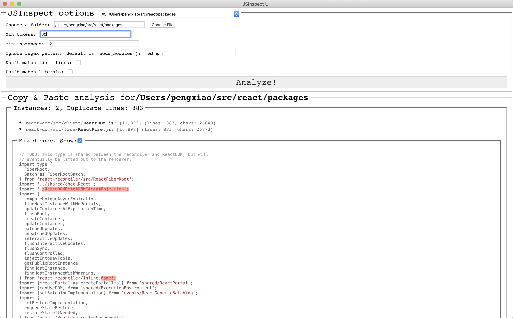

# JSInspect UI

## Demo



## Install

`yarn`

## Build & run (mac)

```
yarn mac
```

## Dev

```
yarn start
```

### How it works:

```
main process (app/index.js) ->
   -> spawn render process[ react spa (src/index.html) ]
     -> main process bind ipcRenderer with preload.js
     -> send `parse` message with ipcRenderer
   -> listens `parse` message from renderer
     -> fork inspector.js for one inspectation round, and send back to main, then main to render (`parsed` message)
     -> inspector is a clone of JSInspect, with some minor fixes to reflect the current state of babel parser.
```
